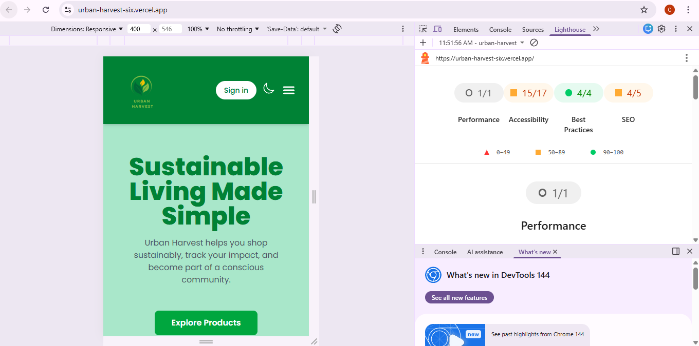

# Urban-Harvest
Urban Harvest is a modern, responsive web application that promotes sustainable living through eco-friendly products, community engagement, and ethical sourcing.

This project is built using HTML, Tailwind CSS, and JavaScript (Vite).

Hosted Link - (https://urban-harvest-six.vercel.app/)

## 📋 Table of Contents

- [Overview](#overview)
- [Live Demo](#live-demo)
- [Features](#features)
- [Tech Stack](#tech-stack)
- [Installation](#installation)
- [Development](#development)
- [Build & Deployment](#build--deployment)
- [Project Structure](#project-structure)
- [Pages Overview](#pages-overview)
- [Design Highlights](#design-highlights)
- [Future Improvements](#future-improvements)
- [Accessibility](#accessibility)
- [Performance](#performance)
- [Browser Support](#browser-support)
- [Author](#author)
- [License](#license)

# Features
Responsive multi-page website

Dark / Light mode toggle

Products page with eco-friendly items

Community blog section

Impact & sustainability information

Subscription / Sign-up form

Mobile navigation menu

Built using Vite for fast development

# Project Structure
my-project/
│
├── index.html
├── package.json
├── package-lock.json
├── vite.config.js
├── tailwind.config.js
├── README.md
│
├── pages/
│   ├── about.html
│   ├── community.html
│   ├── products.html
│   └── subscribe.html
│
├── public/
│   └── images/
│
└── src/
    ├── main.js
    ├── counter.js
    └── style.css

# Technologies Used
HTML

Tailwind CSS

Vanilla JavaScript 

Vite

Ionicons

Google Fonts (Poppins)

# Installation and setup
Clone the repository

git clone https://github.com/your-username/urban-harvest.git

 Navigate to project folder
cd urban-harvest

 Install dependencies
npm install

 Run development server
npm run dev

The project will run on:

http://localhost:5173/

# Pages Overview
Page	Description
Home	Introduction, mission, values, services
About	Sustainability impact and ethical sourcing
Community	Blog posts, recipes, sustainability tips
Products	Eco-friendly product listings
Subscribe	Account creation / Sign-up form

# Design Highlights

Green-themed sustainable branding

Clean card-based layout

Responsive grid system

Accessible and readable typography

Dark mode support

# Future Improvements

Add backend authentication

Add shopping cart functionality

Connect to a real database

Add product filtering & search

# Author

Chamodi Rupasinghe
CB014767

# License

This project is created for educational purposes.